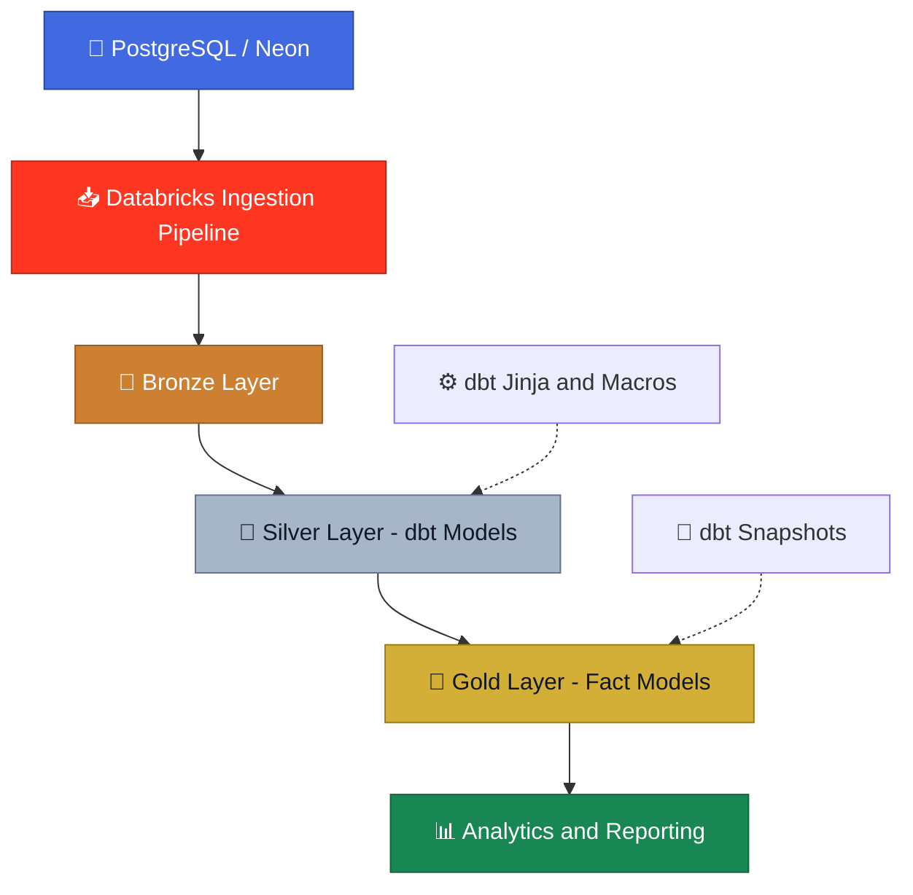

<div align="center">

# 🛒 Walmart End-to-End Data Engineering

### From PostgreSQL Source Data to Analytics-Ready Gold Models

**Building a modular data pipeline using Databricks, SQL, and dbt Core**

<br/>


<br/>

[📂 View Repository](https://github.com/Akash3405/Catu_Walmart_Data_Engineering)
&nbsp; • &nbsp;
[🧑‍💻 Author](https://github.com/Akash3405)

</div>

---

## 🎯 Project Overview

This project demonstrates an end-to-end Data Engineering workflow that ingests Walmart business data from PostgreSQL into Databricks and transforms it into structured, analytics-ready datasets.

The project focuses on modular transformations, configuration-driven SQL generation, reusable dbt logic, historical data tracking, analytical data modeling, and scheduled execution.

### 💡 Key Highlights

- 🔄 **Data Ingestion:** PostgreSQL source tables ingested into Databricks Bronze.
- 🥉 **Bronze Layer:** Landing layer for ingested source data.
- 🥈 **Silver Layer:** Entity-level SQL transformation models.
- 🥇 **Gold Layer:** Analytical fact model for downstream reporting.
- ⚙️ **Configuration-Driven SQL:** Jinja-based dynamic column selection and table joins.
- 🧩 **Reusable dbt Logic:** Macros, model references, and ephemeral helper models.
- 📸 **Historical Tracking:** dbt snapshot configurations for business entities.
- 🚀 **Orchestration:** Databricks ingestion pipeline and dbt transformation job configured on separate daily schedules.
- 🧪 **Data Quality:** dbt tests configured for product ID uniqueness and non-null validation.

---

## 🏗️ Data Architecture



### 🔍 Medallion Architecture

| Layer | Purpose | Implementation |
|---|---|---|
| 🥉 Bronze | Land ingested source tables | Databricks |
| 🥈 Silver | Transform and organize entity-level data | dbt SQL models |
| 🥇 Gold | Prepare analytical datasets | Fact model and snapshots |

---

## 🛠️ Technology Stack

| Technology | Role in the Project |
|---|---|
| 🐍 Python | Data engineering utilities and scripting |
| 🐘 PostgreSQL (Neon) | Source database |
| 🔥 Databricks | Data platform and processing |
| ⚡ Apache Spark / PySpark | Distributed data processing capabilities |
| 🧱 dbt Core | SQL transformation and model dependencies |
| 🌀 Jinja | Dynamic SQL generation |
| 🧩 dbt Macros | Reusable SQL logic |
| 📸 dbt Snapshots | Historical change tracking configuration |
| 🗂️ YAML | Source and project configuration |
| 🌿 Git & GitHub | Version control and source code management |
| 📦 uv | Python environment and dependency management |

---

## 🚀 Key Data Engineering Features

### 1. ⚙️ Configuration-Driven SQL Generation

Implemented in `models/Silver_b/obt_b.sql` using dbt Jinja templating.

- Dynamic SELECT column generation from configuration objects.
- Configurable model references and table aliases.
- LEFT JOIN generation using configured join conditions.
- dbt `ref()` dependencies between transformation models.
- A reusable approach designed to reduce repetitive SQL and simplify future schema extensions.

**Business value:** Adding columns or extending the join structure can require changes primarily to the configuration rather than rewriting the entire SQL statement.

### 2. 🧱 Modular dbt Transformation Framework

- SQL models organized into source, Silver, and Gold layers.
- YAML-based source definitions.
- Reusable schema naming macro.
- Ephemeral helper models for intermediate transformation logic.
- Model dependencies managed using dbt references.

### 3. 📸 Historical Data Tracking

Snapshot configuration files are defined for:

- Customers
- Employees
- Orders
- Products
- Stores

These configurations provide a foundation for historical change tracking. Snapshot strategies, unique keys, and SCD Type 2 behavior should be validated against the configured keys and change-detection logic.

### 4. 📊 Analytical Data Modeling

- Entity-level Silver transformation models.
- Gold-layer order fact model.
- Structured transformation dependencies.
- Modular SQL designed to improve maintainability and downstream analytical use.

### 5. 🧪 Data Quality Testing

The dbt project includes tests for:

- Product ID uniqueness.
- Product ID non-null validation.

The configured tests completed successfully during the verified dbt build run.

---

## 🔄 Data Pipeline Workflow

```text
PostgreSQL Source (Neon)
          |
          v
Databricks Ingestion Pipeline
          |
          v
Bronze Layer
          |
          v
Silver dbt Models
    |         |
    |         +-- Configuration-driven SQL
    |         +-- Reusable macros
    |         +-- Ephemeral helper models
          |
          v
Gold Fact Model
          |
          v
Analytics and Reporting
```

---

## ⏰ Orchestration & Scheduling

The project uses Databricks Jobs and Pipelines to schedule ingestion and dbt transformations.

| Component | Schedule (IST) | Purpose |
|---|---|---|
| PostgreSQL Ingestion Pipeline | Daily, 6:00 AM | Ingest source data into the Bronze layer |
| dbt Transformation Job | Daily, 7:00 AM | Execute `dbt deps` and `dbt build` |

### dbt Transformation Commands

**Step 1: Install project dependencies**

```bash
dbt deps
```

Checks `packages.yml` for declared dbt packages and installs configured dependencies. If no packages are declared, dbt may report that no packages were found.

**Step 2: Build transformation models**

```bash
dbt build
```

Builds configured models and executes applicable tests, snapshots, and seeds according to project configuration and model dependencies.

### Execution Monitoring

The dbt job was manually executed and completed successfully in Databricks.

Verified execution results:

- 6 incremental models completed successfully.
- 2 table models completed successfully.
- 5 snapshots completed successfully.
- 2 data tests passed.
- Total: 15 successful operations.
- Errors: 0.
- Execution time: approximately 47 seconds.

**Scheduling note:** Ingestion and dbt currently use separate time-based schedules. The dbt job is scheduled one hour after ingestion. A time gap does not guarantee that ingestion has completed successfully before dbt starts; explicit dependency-aware orchestration and failure handling remain planned enhancements.

---

## 📁 Project Structure

```text
Akash_DE_2026/
│
├── Catu_Walmart_Project/
│   ├── analyses/
│   ├── macros/
│   │   └── generate_schema_name.sql
│   ├── models/
│   │   ├── Sources/
│   │   ├── Silver_tech/
│   │   ├── Silver_b/
│   │   │   └── obt_b.sql
│   │   └── Gold/
│   │       ├── Facts/
│   │       └── ephemeral/
│   ├── snapshots/
│   ├── tests/
│   └── dbt_project.yml
│
├── src/
├── pyproject.toml
├── uv.lock
└── README.md
```

---

## 📌 Implementation Status

| Component | Status |
|---|---|
| PostgreSQL source data setup | ✅ Completed |
| Databricks Bronze ingestion | ✅ Implemented |
| Silver transformation models | ✅ Created and executed |
| Gold fact model | ✅ Created and executed |
| Configuration-driven SQL generation | ✅ Implemented |
| dbt macros and ephemeral helper models | ✅ Added |
| Snapshot configuration files | ✅ Added and executed |
| Git and GitHub version control | ✅ Completed |
| Databricks ingestion schedule | ✅ Configured for 6:00 AM IST |
| dbt transformation schedule | ✅ Configured for 7:00 AM IST |
| Manual dbt build validation | ✅ Successful |
| Dependency-aware ingestion and dbt orchestration | 🟡 Planned |
| Automated failure handling and notifications | 🟡 Planned |
| Snapshot strategy and SCD Type 2 validation | 🟡 Planned |

---

## 🔮 Planned Enhancements

- 🔗 Configure dependency-aware orchestration between ingestion and dbt transformations.
- 🧪 Expand automated data quality checks.
- 📸 Validate snapshot behavior and SCD Type 2 requirements.
- ⚡ Evaluate incremental processing where appropriate.
- 📈 Improve execution monitoring, failure handling, and notifications.
- 📚 Document pipeline dependencies, lineage, and operational procedures.

---

## 💼 Skills Demonstrated

`SQL` · `Python` · `PostgreSQL` · `Databricks` · `Apache Spark` · `dbt Core` · `Jinja` · `Data Modeling` · `Data Quality` · `Git` · `GitHub`

---

<div align="center">

## ⭐ Explore the Project

**Thanks for visiting!**

[](https://github.com/Akash3405/Catu_Walmart_Data_Engineering)

*Built as a hands-on Data Engineering portfolio project.*

</div>